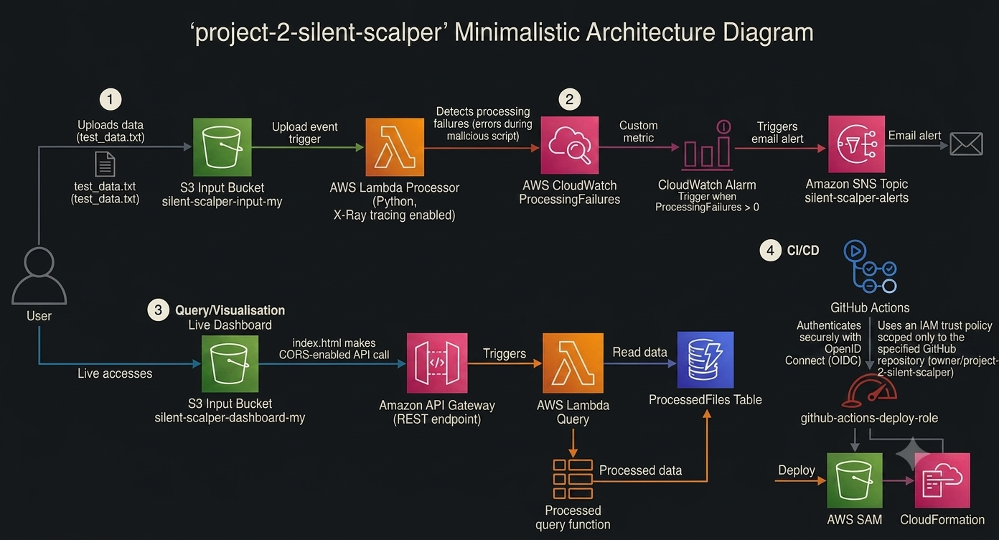

# Project 2: Silent Scalper — Serverless Data Processing Pipeline

## Technical Overview
An event-driven serverless architecture engineered to process, validate, and isolate data files automatically, complete with real-time alerting, observability, and a live metrics dashboard—fully defined and deployable as secure Infrastructure as Code (IaC).

## Key Innovations & Success Stories

This project represents significant milestones in mastering the AWS and IaC ecosystems. To achieve a successful, production-ready pipeline, I proactively identified and resolved critical architectural challenges:

* **IaC Circular Dependency Resolution (The SAM Trigger):** I successfully diagnosed and resolved a notorious AWS SAM "circular dependency" during the initial deployment. By strategically modifying the `template.yaml` to reference the S3 bucket's name (`silent-scalper-input-my`) using a `!Sub` string for the Lambda `S3ReadPolicy` instead of the direct `!Ref` resource, I broke the creation loop, enabling CloudFormation to build the stack without freezing.

* **Keyless CI/CD Federation (OIDC):** I implemented a modern, secure, and keyless GitHub Actions deployment workflow using **OpenID Connect (OIDC)**. By federating GitHub and AWS, I eliminated the risk of storing static, long-lived AWS Access Keys within GitHub, ensuring a secure-by-default deployment process.

* **Full Observability with X-Ray:** To ensure production-ready stability, I enabled **AWS X-Ray distributed tracing** on all Lambda functions. This provides immediate, visual tracing of requests as they travel from S3 through the processing Lambda to DynamoDB, SNS, or CloudWatch, simplifying future debugging and performance optimization.

## Architecture & Flows



This diagram visualizes four primary system flows, incorporating the specific implementation details that made this project successful.

| Flow | Description | Key Services |
| :--- | :--- | :--- |
| **Ingestion** | User (or automation) uploads data to S3 Input Bucket | S3, Lambda, X-Ray |
| **Processing** | Event-driven Lambda validates data, isolates malicious files to Quarantine Bucket, and stores valid records in DynamoDB | S3, Lambda, DynamoDB, X-Ray |
| **Alerting** | Processing failures are tracked as custom CloudWatch metrics, triggering an alarm that dispatches a real-time email alert | CloudWatch, SNS, Email |
| **Dashboard** | A public, serverless dashboard hosted on S3 fetches real-time processing metrics via API Gateway with CORS enabled and no authentication | S3 (Static), API Gateway, Lambda, DynamoDB, X-Ray |

## Engineering Decisions

* **Infrastructure as Code (IaC):** Defined entirely with **AWS SAM**, ensuring a clean, reproducible, and easily manageble full-stack deployment (Day-18 ready for free-tier conclusions).
* **Observability:** Integrated **AWS X-Ray** on functions for granular, end-to-end distributed tracing. Custom metrics and alarms provide proactive system health monitoring.
* **IAM & Security:** Engineered using SAM's built-in, pre-scoped policy templates (`S3ReadPolicy`, `DynamoDBCrudPolicy`, `SNSPublishMessagePolicy`) to strictly enforce **least privilege access** for all functions.
* **FinOps & Impact:** Zero idle cost structure—Lambda, S3, and DynamoDB (PAYG) are entirely reactive. Bad data is automatically isolated, preventing database corruption and ensuring data integrity.

## Live Demo & Usage

-   **Dashboard:** [http://silent-scalper-dashboard-my.s3-website-us-east-1.amazonaws.com](http://silent-scalper-dashboard-my.s3-website-us-east-1.amazonaws.com)
-   **API Endpoint:** `GET {https://qthxywo9bi.execute-api.us-east-1.amazonaws.com/Prod/files}/files`

### Self-Hosted Deployment
```powershell
cd project-2-silent-scalper/infrastructure
sam build
sam deploy --guided  # Use guided flag for initial environment configuration (Region, Suffix, Email, etc.)
