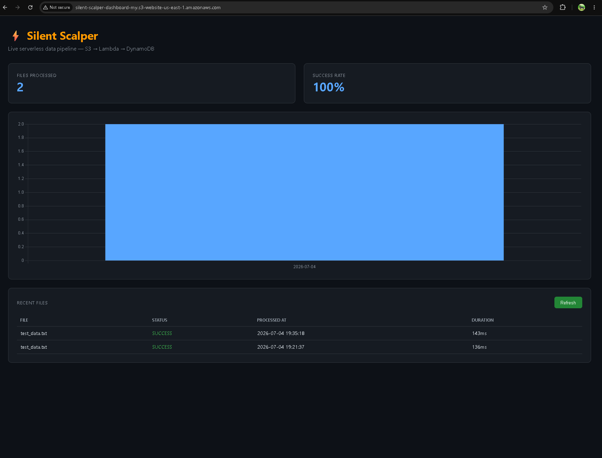
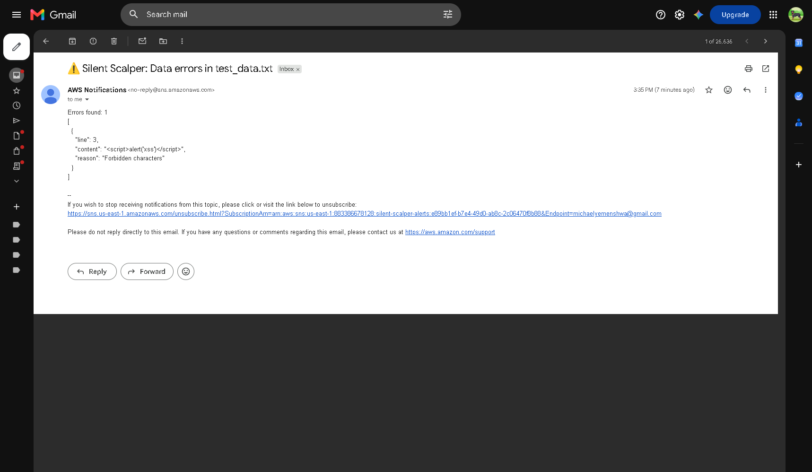

# Silent Scalper — Event-Driven Serverless Data Processing Pipeline

## Technical Overview
An enterprise-grade, event-driven serverless architecture engineered to ingest, programmatically validate, and isolate data streams automatically. The entire stack features real-time alerting telemetry, distributed tracing observability, and a live web metrics dashboard—fully provisioned and managed as secure **Infrastructure as Code (IaC)**.

---

## Architecture & System Flows


The system governs data across four distinct operational flows, enforcing isolation boundaries and execution observability at every stage:

| Core Flow | Architectural Mechanism | Key Integrated Services |
| :--- | :--- | :--- |
| **1. Data Ingestion** | Object landing triggers reactive computing resources instantly without long-running compute overhead. | AWS S3, AWS Lambda, AWS X-Ray |
| **2. Threat Processing** | In-flight content validation separates valid payloads for structured persistence while isolating malicious injections. | AWS S3, AWS Lambda, Amazon DynamoDB |
| **3. Real-Time Alerting** | Telemetry tracking monitors processing anomalies and breaches, dispatching asynchronous notifications immediately. | Amazon CloudWatch, Amazon SNS, Email |
| **4. Edge Visualization** | Decoupled client browser fetches metrics from a serverless REST API backed by Cross-Origin Resource Sharing (CORS). | AWS S3 (Static), Amazon API Gateway, DynamoDB |

---

## Core Engineering Achievements & Troubleshooting Successes

This architecture serves as validation of production cloud engineering patterns, requiring deep-dive debugging across infrastructure orchestration and identity federation:

* **IaC Circular Dependency Resolution:** Diagnosed and resolved a classic CloudFormation race condition during initial stack assembly. The Lambda function's IAM template required explicit access to the S3 bucket via an `S3ReadPolicy`, while the S3 bucket simultaneously required structural awareness of the Lambda function to register object creation notifications. By refactoring the template to reference the bucket identifier using a string interpolation expression (`!Sub "silent-scalper-input-${InitialsSuffix}"`), the compile-time loop was broken, permitting smooth parallel provisioning.
* **Keyless CI/CD Identity Federation (OIDC):** Eliminated the security risks of long-lived, static cloud access keys inside GitHub. Implemented secure token-based web identity federation via an **OpenID Connect (OIDC)** identity provider role. This establishes dynamic, short-lived security credentials tightly scoped exclusively to this specific repository's deployment actions.
* **Granular Least-Privilege IAM Engineering:** Rejected broad wildcard (`*`) access controls. Built custom execution policies around highly specific micro-permissions (`S3ReadPolicy`, `DynamoDBCrudPolicy`, `SNSPublishMessagePolicy`), strictly confining component communication profiles to the minimum required operational scope.
* **Distributed Tracing & Observability:** Outfitted the computing environment with **AWS X-Ray** daemon layers. This provides exhaustive, distributed transaction tracking across every hop of the execution pipeline, turning black-box serverless compute runs into clear, measurable data paths.

---

## Production Implementations & Live Metrics

### Pipeline Verification Evidence

#### 1. Live Serverless Dashboard Tracking
The static user interface automatically queries the backend REST endpoints to capture and display file states, real-time volume metrics, and pipeline health scores:


#### 2. Automated SNS Alert Despatch
When an active payload containing Cross-Site Scripting (`<script>`) elements is ingested, the engine quarantines the file and broadcasts an automated notification:


### Live Infrastructure Deployments
* **Interactive Web Interface:** [http://silent-scalper-dashboard-my.s3-website-us-east-1.amazonaws.com](http://silent-scalper-dashboard-my.s3-website-us-east-1.amazonaws.com)
* **Production API Endpoint:** `GET https://qthxywo9bi.execute-api.us-east-1.amazonaws.com/Prod/files`

---

## Local Deployment & Verification Matrix

Follow these operational steps to build, configure, and execute validation testing within your own cloud environment.

### Step 1: Infrastructure Provisioning
Initialize the compilation environment and invoke the cloud automation deployment wizard using the AWS Serverless Application Model (SAM):
```powershell
# Navigate to the infrastructure context
cd project-2-silent-scalper/infrastructure

# Build and package local dependencies
sam build

# Execute guided cloud architecture deployment
sam deploy --guided
```
### Step 2: Inject Test Payloads & Verify Pipeline Response 
Generate a structured text validation file containing an active security exception string, then copy it directly to your live intake bucket using the AWS CLI:
```powershell
# 1. Create a mock log asset containing an inline XSS attack vector
$content = @"
alice,28,engineer
bob,32,manager
<script>alert('xss')</script>
diana,29,analyst
"@

# 2. Write the payload cleanly with accurate encoding to disk
$content | Out-File -FilePath test_data.txt -Encoding ascii

# 3. Stream the file directly up into the intake bucket to fire the architecture
aws s3 cp test_data.txt s3://silent-scalper-input-my/
```

## Business & FinOps Realization
Zero-Idle Cost Efficiency: Computes operate entirely on demand under a Pay-As-You-Go pricing model, drawing zero baseline maintenance or idle server expenses.

Data Tier Guardrails: System logic keeps malicious inputs safely sequestered at the edge boundary, protecting data consumers from database contamination.

Rapid Disaster Recovery: The complete stack is entirely modular and reproducible, letting you tear down and stand up a fresh, pristine staging cluster in under five minutes.
