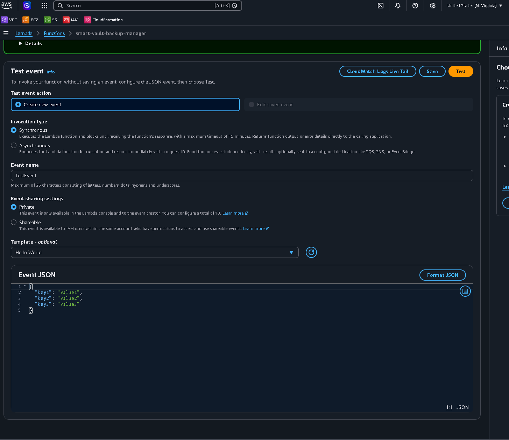

# Smart Vault: Tag-Driven Automated Backup & Cross-Region Disaster Recovery (IaC)


An enterprise-grade, event-driven backup orchestration system that automates Elastic Block Store (EBS) snapshots and manages a cross-region Disaster Recovery (DR) pipeline. The entire infrastructure—including compute, IAM security layers, networking, and automation schedules—is managed entirely as code via AWS SAM (CloudFormation).

---

## 🏗️ Architecture & Infrastructure Diagram

The architecture utilizes a completely decoupled, serverless coordination model. Rather than relying on rigid cron scripts maintained inside virtual machines, AWS EventBridge coordinates cloud-native triggers to enforce zero-trust data protection policies dynamically.

> 📍 **Architecture Diagram Placeholder**
> *Replace the image link below with the path to your custom infrastructure diagram file once created.*


---

## 🎯 Key Engineering Decisions

### 1. Eliminating Race Conditions via Boto3 Runtime State Waiters
During initialization testing, a cloud race condition was identified: the asynchronous nature of EBS snapshot generation caused immediate cross-region copy replication commands to terminate with a `"StateMessage": "Source snapshot is not complete"` error in `us-west-2`. 

To solve this, a runtime interceptor block utilizing native **Boto3 Waiters** was engineered directly into the backup thread loop. The Lambda routine is forced to hold state execution, checking integrity parameters every 15 seconds:

```python
# Synchronize asynchronous block writes before regional replication
snapshot_waiter = ec2.get_waiter('snapshot_completed')
snapshot_waiter.wait(
    SnapshotIds=[snapshot_id],
    WaiterConfig={'Delay': 15, 'MaxAttempts': 15}
)
```

### 2. Zero-Trust Fleet Management (Portless Architecture)
Traditional operations rely on exposing port 22 or distributing brittle SSH `.pem` keys to administer instances. This design enforces a **Zero-Trust portless strategy** utilizing **AWS Systems Manager (SSM) Session Manager**. 
* The production EC2 instance contains no inbound open security group rules.
* Administrative shell environments are brokered entirely via standard HTTPS (Port 443) calls managed through cryptographically secured IAM policies.

### 3. Decoupled Dynamic AMI Resolution
To maintain a modern, secure, and patch-compliant environment without hardcoding brittle Amazon Machine Image (AMI) IDs into the infrastructure templates, the deployment engine performs a dynamic lookup during execution from the AWS Systems Manager Parameter Store:
```yaml
ImageId: '{{resolve:ssm:/aws/service/ami-amazon-linux-latest/al2023-ami-kernel-default-x86_64}}'
```

---

## 🛠️ Automated CI/CD Pipeline (GitHub Actions)

The repository features a fully automated GitOps pipeline using GitHub Actions. It implements cryptographic verification via **OpenID Connect (OIDC)**, letting GitHub securely assume temporary, short-lived IAM credentials in AWS without storing long-lived, high-risk access keys.

### Overcoming Pipeline Hurdles
* **Dynamic S3 Resolution:** Integrated the `--resolve-s3` flag within the headless runner instance to allow automated provisioning of localized configuration buckets.
* **Least-Privilege Lifecycle Controls:** Diagnosed and corrected an `AccessDeniedException` by designing an inline policy granting permissions exclusively to the SSM global parameter registry pathways (`arn:aws:ssm:us-east-1::parameter/aws/service/*`).

---

## 📸 Technical Walkthrough & Verification

### 1. CI/CD Pipeline Execution Verification
The GitHub Actions GitOps engine builds, evaluates, and deploys the entire infrastructure stack completely hands-free on every push to the `main` branch.


### 2. Primary Infrastructure Snapshot Processing (`us-east-1`)
Upon execution, the automated backup engine locates all active storage volumes matching the tag query criteria and commits a block-level backup point.
.png)

### 3. Cross-Region Disaster Recovery Replication (`us-west-2`)
Once verified by the Boto3 waiter block, storage blocks are automatically copied securely across regions to Oregon (`us-west-2`) to safeguard against total primary regional outages.
.png)

### 4. Consolidated Operational Reporting
An integrated notification pipeline broadcasts complete telemetry detailing instances evaluated, copies archived, and dynamic lifecycle pruning summaries directly to operators.
.png)

---

## 📊 AWS Services Breakdown

| Component | Engineering Purpose |
|---|---|
| **EC2 / EBS** | Hosts operational systems with target storage volumes needing state protection. |
| **AWS Lambda** | Orchestrates discovery queries, runs state verification, and targets DR duplication loops. |
| **EventBridge** | Operates as a serverless cluster cron runner triggering automated schedules. |
| **Amazon SNS** | Broadcasts runtime execution reports and handles urgent operational alarms. |
| **CloudWatch** | Monitors operational success patterns and logs pipeline data streams. |
| **AWS SSM** | Enables secure console interaction and resolves global AMI definitions at runtime. |
| **AWS SAM** | Enforces atomic infrastructure deployments as code for consistent environments. |

---

## 💼 Business Metrics & Operational Impact

* **Zero Human Overhead:** Transitions recovery requirements from manual engineering schedules to a self-healing, code-enforced matrix.
* **Survives Regional Disasters:** Securing standalone copies outside the core infrastructure footprint protects operations from comprehensive AWS regional failures.
* **Predictable Cost Allocation:** Storage costs are strictly bounded and predictable through policy-driven retention enforcement, automatically cleaning up stale snapshot variants.
