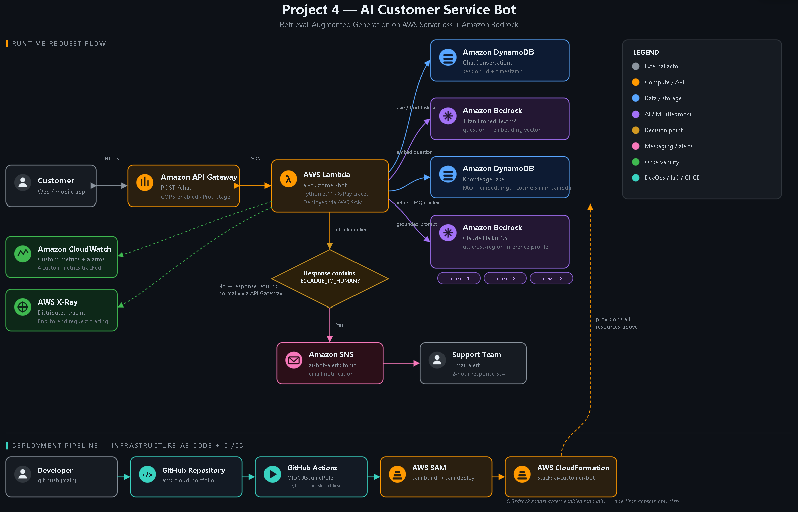
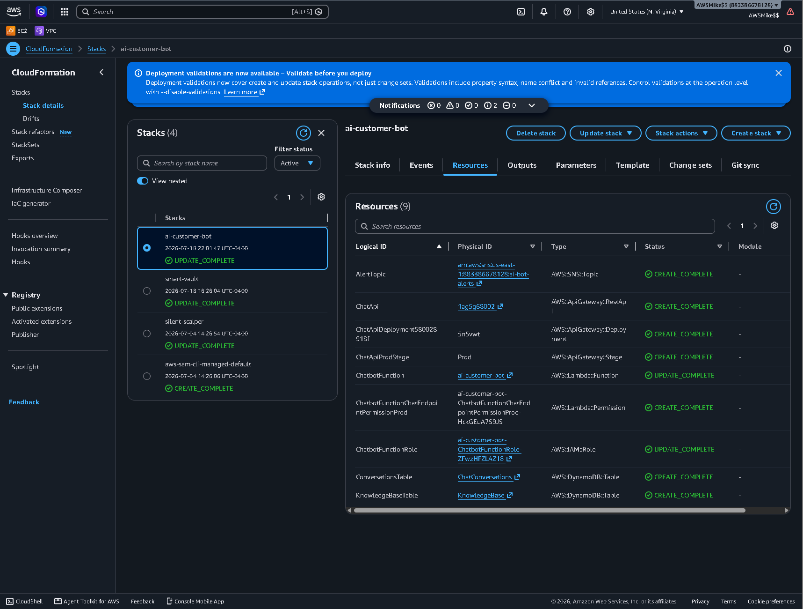
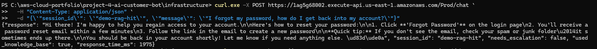
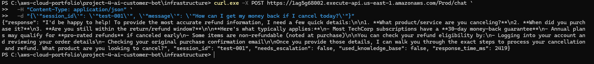
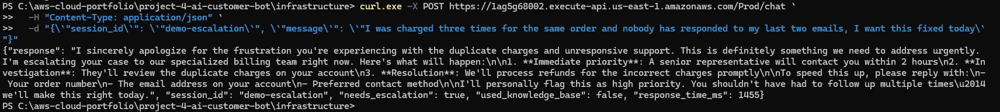
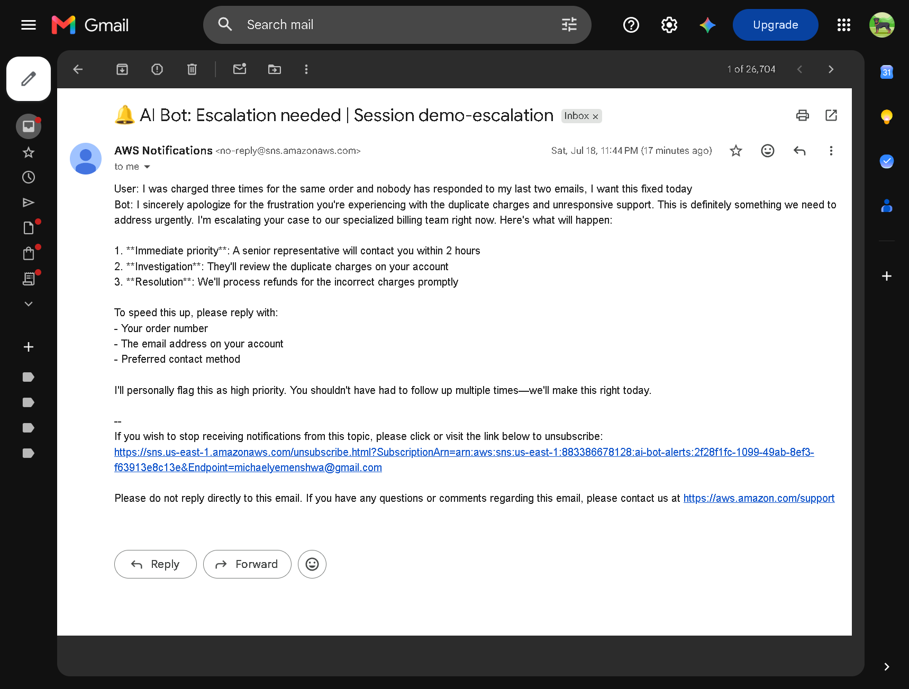
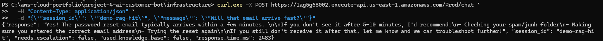
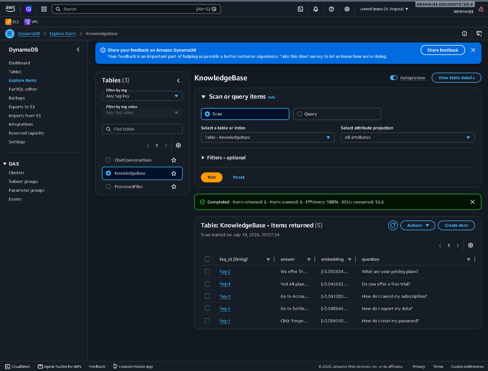
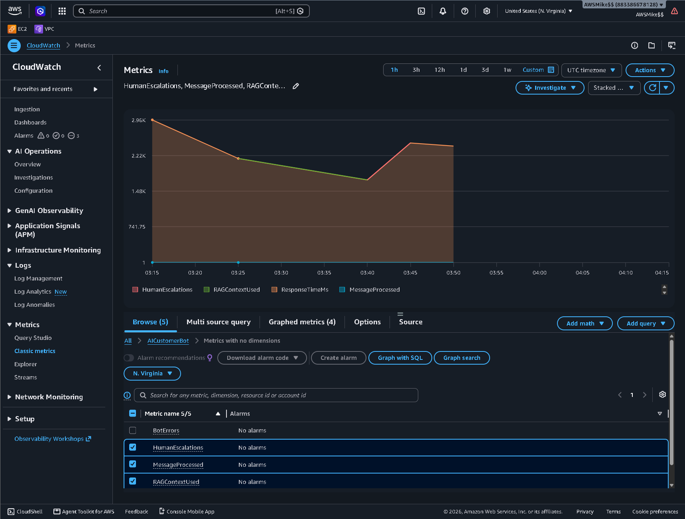
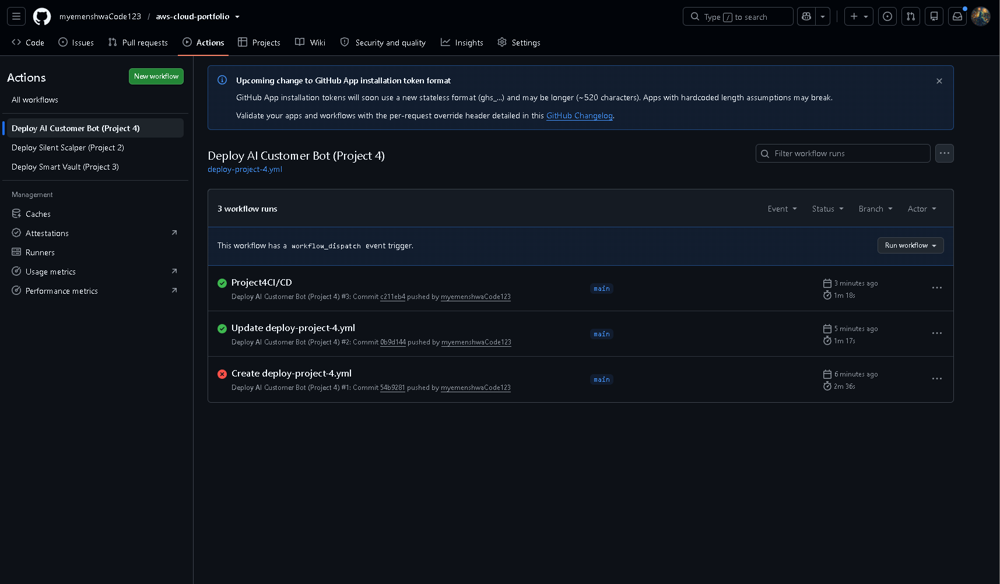

# Project 4: AI Customer Service Bot with Retrieval-Augmented Generation

## Overview
A production-pattern AI customer service system built on Amazon Bedrock (Claude Haiku 4.5),
grounded in a real knowledge base via Retrieval-Augmented Generation — not just a prompt
wrapper around an LLM API. Fully defined as Infrastructure as Code and deployed via CI/CD.

## Architecture


## Live Proof

**Infrastructure deployed via IaC** — entire stack, zero manual console clicks:


**RAG retrieval working** — the bot grounds its answer in indexed FAQ data:


**Graceful fallback** — when no FAQ confidently matches, it says so instead of forcing irrelevant context:


**Human escalation** — business-critical issues automatically flagged and alerted:



**Multi-turn memory** — conversation context persists across messages via DynamoDB:


**Knowledge base with real embeddings**:


**Observability** — custom CloudWatch metrics:


**CI/CD** — auto-deploys on push via keyless OIDC:


## Why RAG-lite Instead of a Managed Vector Database
Standard RAG implementations use a managed vector store (OpenSearch, Pinecone), which costs
$50–700+/month minimum — not viable on a free-tier budget. This implementation computes cosine
similarity directly in Lambda against embeddings stored in DynamoDB. At small-to-medium knowledge
base sizes (hundreds to low-thousands of documents) this performs well at near-zero cost. It's a
deliberate, explainable architectural tradeoff — the same retrieval pattern would migrate to
OpenSearch/pgvector at genuine scale, with no changes needed to the surrounding system design.

## Engineering Challenge: Bedrock Model Lifecycle
Mid-build, the originally planned model (Claude 3 Haiku) returned `AccessDeniedException` —
AWS had transitioned it to **Legacy** status, requiring reactivation through AWS Marketplace
subscription actions not covered by a standard least-privilege Bedrock policy. Rather than
fight for reinstated access to a deprecated model, I traced the issue through `sam logs`,
confirmed via AWS's model lifecycle documentation that **Claude Haiku 4.5** is the current
Active successor, and migrated to it.

That migration surfaced a second issue: Claude Haiku 4.5 can't be invoked by its bare model
ID via on-demand throughput — it requires a **cross-region inference profile**
(`us.anthropic.claude-haiku-4-5-20251001-v1:0`), which in turn requires IAM permissions on
the profile ARN *and* the underlying foundation model in every region the profile can route
to (us-east-1, us-east-2, us-west-2), not just the calling region. The IAM policy in
`infrastructure/template.yaml` reflects this — five separate Bedrock resource ARNs, each with
a comment explaining why it's there.

This is a real, current AWS Bedrock behavior (model lifecycle transitions + inference profile
requirements for current-generation models), not a one-off bug — worth knowing if you deploy
this stack yourself months from now and hit something similar.

## AWS Services
| Service | Purpose |
|---|---|
| API Gateway | Customer-facing REST endpoint |
| Lambda | Orchestration + RAG retrieval logic (X-Ray traced) |
| DynamoDB | Conversation history + knowledge base vector storage |
| Amazon Bedrock (Claude Haiku 4.5) | Response generation via cross-region inference profile |
| Amazon Bedrock (Titan Embeddings V2) | Semantic search embeddings |
| SNS | Human escalation alerts |
| CloudWatch | Response time, escalation rate, RAG usage metrics |
| AWS SAM | Infrastructure as Code — full stack deploys in one command |
| GitHub Actions | CI/CD via keyless OIDC federation |

## Deploy It Yourself
```bash
cd infrastructure
sam build
sam deploy --guided
cd ../scripts
python build_knowledge_base.py
```

## Business Impact
- Answers are grounded in actual company knowledge, reducing hallucination risk
- Automatic escalation to humans for anything the system can't confidently resolve
- Full conversation history enables future fine-tuning and analytics
- Fractions of a cent per conversation turn at Claude Haiku 4.5 + Titan Embeddings pricing
